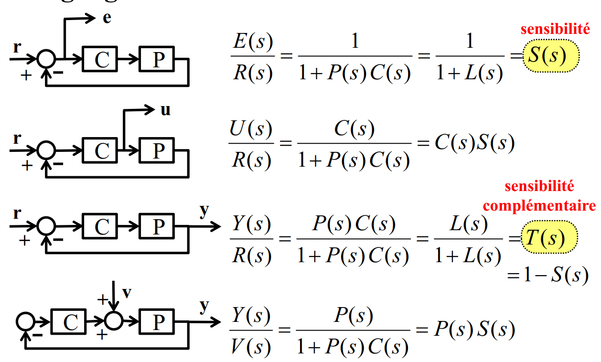
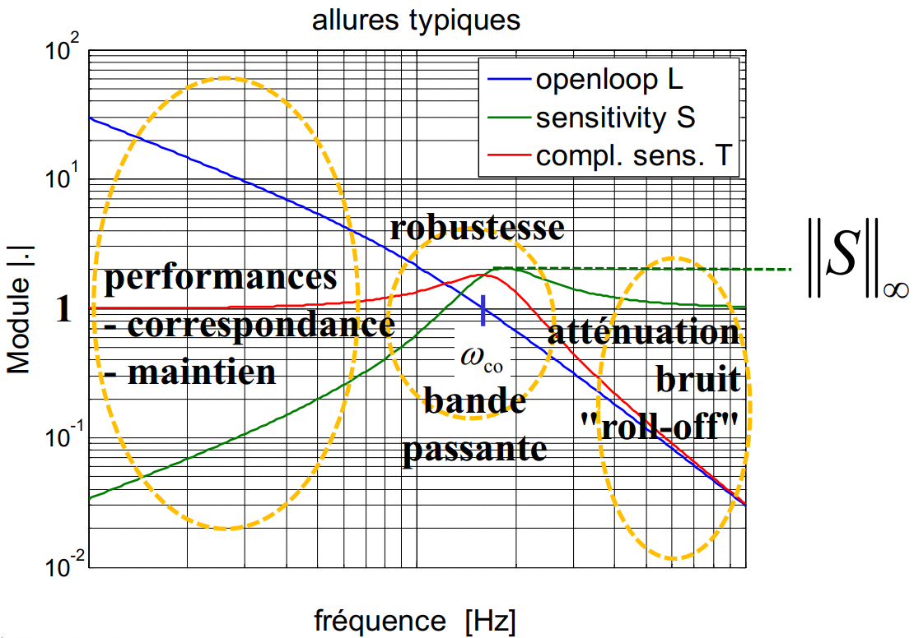
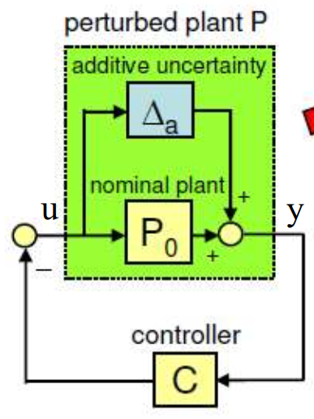
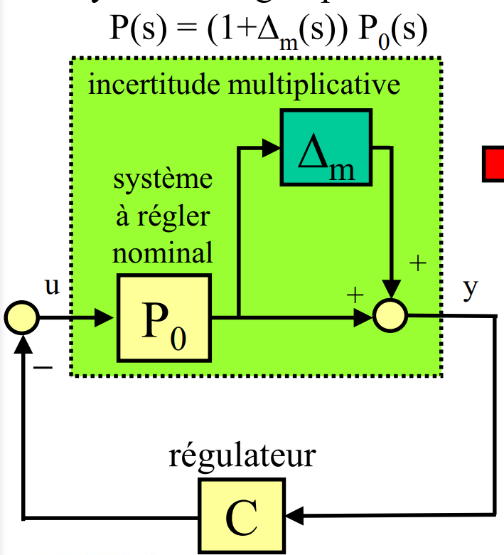

# TSM_AdvContr

PID fonctionne bien mais il est limité à une entrée et une sortie

Ce n'est pas un réglage systématique

La régulation moderne est intrinsèquement basée sur un modèle (systématique)

on va utiliser des système LTI

## Espace d'état

Chaque variable d'état est liée au

- stockage de matière
- stockage d'énergie
- stockage d'information (numérique)

Un système LTI continu est défini par 4 matrices 
$$
\dot{x}= Ax+Bu\\
y = Cx +Du
$$
 Un système LTI discret est défini par 4 valeurs
$$
x[k+1] = A_n x[k] + B_n u[k]\\
y[k] = C_n x[k] + D_n u[k]
$$
A : matrice carrée système

B : matrice d'entrée

C : matrice de sortie

D : matrice de bypass

Si D = 0 alors les hautes fréquences ne passent pas

## Règle de mason

Chaine d'action sur 1 + ou - la boucle ouverte

sur rétroaction pos alors 1 - 
$$
\frac{ChaineAction}{1 \pm BoucleOuverte}
$$

## Gain statique

$G(s\space ou\space z)= C(sI-A)^{-1}B+D$ 

En analogique (continu) $G(s=0)=-CA^{-1}B+D$ 

En numérique (discret) $G(z=1)= -C(I-A)^{-1}B+D$ 

## Relation entre s et z

$$
z = e^{sh}
$$

## Pôles

Les pôles du système sont les valeurs propres de A

On le calcul de la manière suivante:

$det(sI-A) = 0$ 

## Cours 2

### Sur paramétrisation

$$
G(s) = \frac{b_2s^2+b_1s+b_0}{s^2+a_1s+a_0} \rightarrow 5param\\
A : 2x2 = 4param\\
B : 2x1 = 2param\\
C : 1x2 = 2param\\
D : 1x1 = 1param\\
$$

Il y a donc 9 paramètres dans espace d'état pour 5 paramètres dans la fonction de transfert

### Transformation linéaires dans l'espace d'état

$$
\overset{\sim}{A} = T^{-1}AT\\
\overset{\sim}{B} = T^{-1}B\\
\overset{\sim}{C} = CT\\
\overset{\sim}{D} = D
$$

### Forme modale / décomposition en éléments simples

$$
G(s) = \frac{2s+1}{s^2+5s+6} = \frac{2s+1}{(s+2)(s+3)}\\
G(s) = \frac{R_1}{(s+2)} + \frac{R_2}{(s+3)}\\
G(s) = \frac{-3}{(s+2)} + \frac{5}{(s+3)}\\
$$

Mise en // des deux parties de la fraction de G(s)
$$
\begin{cases}
\dot{x}_1 = -2x_1+0x_2+1u\\
\dot{x}_2 = 0x_1-3x_2+1u\\
y = -3x_1+5x_2+0u\\
\end{cases}
$$

$$
A=
\begin{bmatrix}
-2&0\\
0&-3
\end{bmatrix}
B=
\begin{bmatrix}
1\\
1
\end{bmatrix}\\
C=
\begin{bmatrix}
-3&5\\
\end{bmatrix}
\space\space D=0
$$

Avec A une matrice diagonale 

### Rappel : valeurs propres et vecteurs propres

$\lambda_{1,2} = det(\lambda I-A)=0$

$v_{1,2} = A\vec{v}_1 = \lambda_1\vec{v}_1$ 

### Diagonalisation

$\overset{\sim}{A} = T^{-1}AT$ avec $T=\begin{bmatrix}
\vec{v}_1&|\vec{v}_2&|\vec{v}_3\\
\end{bmatrix}$ 

$\overset{\sim}{A} = \begin{bmatrix}
\lambda_1&0&0\\ 0&\lambda_2&0\\ 0&0&\lambda_3\\
\end{bmatrix}$

### Exponentielle matricielle

suite de Taylor
$$
e^{At} = I+At+\frac{(At)^2}{2!}+\frac{(At)^3}{3!}+...+\frac{(At)^n}{n!}
$$
matrice de transition

#### méthode d'euler

$$
\dot{x} = Ax\\
\dot{x} = \frac{x[k+1]-x[k]}{h}\\
\frac{x[k+1]-x[k]}{h} \approx Ax[k]\\
x[k+1]\approx (I+Ah)x[k]
$$

#### diagonalisation de e^At

$$
\overset{\sim}{A} = T^{-1}AT\\
A=T\overset{\sim}{A}T^{-1}\\
e^{At} = e^{(T\overset{\sim}{A}T^{-1})t}\\
e^{At} = e^{\overset{\sim}{A}t} = 
\begin{bmatrix}
e^{\lambda_1t} & 0& 0\\
0&e^{\lambda_2t} & 0\\
0&0&e^{\lambda_3t}\\
\end{bmatrix}
$$

## Cours 3

Les valeurs propres de A sont les pôles du systèmes

### Modèle échantillonné

$$
H(z) = \frac{z-1}{z}\cdot Z\{L^{-1}(\frac{G_a(s)}{s})\}
$$

changement de l'espace d'état en numérique
$$
A_d = e^{A_a\cdot h}\\
B_d = \int_0^h e^{A_a\cdot\tau}B_a d\tau\\
C_d = C_a\\
D_d = D_a
$$
matlab c2d

### retour d'état

les objectifs :

- boucle fermée stable et avec une dynamique appropriée (oscillation,...)
- bonne régulation de correspondance (tracking)
- bonne régulation de maintien

$$
\dot{x} = Ax+Bu\\
u = -Kx\\
\dot{x} = Ax - BKx\\
\dot{x} = (A-BK)x\\
A_{bf} = (A-BK)
$$

### commandabilité

Le rang de la matrice Pc doit être plein n 
$$
P_c = 
\begin{bmatrix}
\vec{B}|\vec{AB}|\vec{A^2B}|...|\vec{A^{n-1}B}
\end{bmatrix}
$$

### forme commandable

il faut que la puissance la plus élevée du den soit unitaire $s^n\cdot 1$ 
$$
G(s) = \frac{b_2s^2+b_1s+b_0}{s^3+a_2s^2+a_1s+a_0}
$$

$$
A=
\begin{bmatrix}
0&1&0\\
0&0&1\\
-a_0&-a_1&-a_2
\end{bmatrix}
B=
\begin{bmatrix}
0\\
0\\
1
\end{bmatrix}\\
C=
\begin{bmatrix}
b_0&b_1&b_2\\
\end{bmatrix}
\space\space D=0
$$

si deg relatif = 0 alors il faut extraire le gain haute fréquence qui va se répercuter sur le D

## Cours 4 

### réalisation minimale

minimum de variable d'état s système

### formes quadratiques

#### Inconvénients du placement de pôles

1. multi-entrées : sous déterminer (plusieurs réalisation avec les mêmes pôles)
2. déterminer la position des pôles ? 
3. compromis entre la rapidité et la robustesse ? 

#### quadratique

c'est un polynôme homogène -> tous les monôme ont le même degrés

#### forme

$$
Q(x_1,...,x_n) = \sum_{i=1}^{n}\sum_{j=1}^{n}m_{ij}\cdot x_i\cdot x_j = \vec{x}^T\cdot M\cdot \vec{x}
$$

ou M est une matrice sysmétrique
$$
M = 
\begin{bmatrix}
M_{11} & M_{12}\\
M_{12} & M_{22}
\end{bmatrix}\\
x^T\cdot M\cdot x = M_{11}x_1^2+2M_{12}x_1x_2+M_{22}x_2^2
$$

### Critère de syvlester

calculer les det en partant de en haut à gauche pour chaque valeur de n si ils sont tous positif alors M>0

### LQR

fonction de coût à minimiser
$$
J = \int_0^{\infty}(x^TQx + u^TRu)dt
$$
Avec $Q\geq0$ et $R > 0$  

### Solution LQR analogique

$$
K = R^{-1}B^TP\\
A^TP + PA-PBR^{-1}B^TP = -Q \space\space\space// équation\space de\space Riccati
$$

### Solution LQR discreet

$$
K = (R+B^TPB)^{-1}B^TPA\\
A^TPA-P-A^TPB(R+B^TPB)^{-1}B^TPA+Q=0\space\space\space// équation\space de\space Riccati\space discret
$$

### Choix de Q

si on veut pénalisé que la sortie. On a $Q = C^tC \geq 0$  

le R reste arbitraire

## Cours 5 

### rappel nyquist simplifié 

Il faut que la boucle ouverte soit stable sinon il faut le critère généralisé
$$
G_o(s) = G_a(s)\cdot G_c(s)\\
G_{yw}(s)=\frac{G_o(s)}{1+G_o(s)}
$$

#### boucle ouverte

$$
G_o(s) = K(sI - A)^{-1}B
$$

#### marge de phase

1. identifier module = 0
2. à la même pulsation regarder le diff entre -180 et la phase actuelle

#### marge de gain

1. identifier la phase à -180 
2. à la même pulsation regarder la diff entre le module et 0

### Nyquist généralisé

Utilisable en tout temps 

la boucle ouverte doit exactement encercler le point critique dans le sens trigonométrique le nombre de pôle instable.

pour compter le nombre d'encerclement il faut fixer un élastique sur le point critique et l'autre bout suit la courbe de $-\infty$ à $\infty$ 

marge de phase et de gain

tracer un cercle unité centré à 0 et check les intersections entre lieux de nyquist et le cercle le plus petit angle nous donne la marge de phase.

### régulation de correspondance LQR

$$
e = y-r \space//erreur\\
\dot{e} = \dot{y} = C\dot{x} \space// \dot{r} = 0\\
z = \dot{x} \space et \space w=\dot{u}
$$

## Cours 6

### marge de phase (nyquist simplifié)

$$
\varphi_m = arg(G_o(j\omega_{co})) + \pi\\
|G_o(j\omega_{co})| = 1
$$

### distance critique

distance entre le point critique (-1) et la courbe du lieux de Nyquist
$$
d_{crit} = min(dist(-1,L(j\omega)))
$$
pour assurer une robustesse (même avec les erreurs de modélisation on tombe juste)

### Observateur

un observateur stochastique est le filtre de Kalman

#### observateur trivial 

l'erreur est $\dot{x}_e=Ax_e$ ce qui donne $x_e(t)=e^{At}x_{e,0}$ donc converge si les valeurs propres de A sont toutes négatives.

#### observateur complet

erreur = $x_e = (x - \hat{x})$ la dynamique de l'erreur est donc $\dot{x}_e = (A-HC)x_e$ 

$A_{obs} = (A-HC)$ avec H libre

convergence si toutes les la valeurs propres ont une partie réelle négative

### Observabilité

$$
P_o = 
\begin{bmatrix}
C\\
CA\\
CA^2\\
\vdots\\
CA^{n-1}
\end{bmatrix}
$$

le rank doit être n pour être observable => en monosortie $det(P_o \neq 0)$ 

### Dynamique du système

$$
\begin{cases}
\hat{x}[k+1] = A\hat{x}[k]+Bu[k]+H(y[k]-\hat{y}[k])\\
\hat{y}[k] = A\hat{x}[k]+Du[k]
\end{cases}
$$

### Séparation 

$$
\begin{bmatrix}
\dot{x}\\
\dot{\hat{x}}
\end{bmatrix} = 
\begin{bmatrix}
A-BK & BK\\
0 & A-HC
\end{bmatrix}
\begin{bmatrix}
x\\
\hat{x}
\end{bmatrix}
$$

Les pôles de la boucle fermée sont composés des pôles de la synthèse du retour d'état K et de la synthèse de l'observateur H

### LTR

on fait la synthèse du retour d'état normalement puis pour la synthèse de l'observateur on choisit des valeurs spécifique de Q et R $Q=\rho BB^T$ et $ R=1$ plus rho est grand meilleur sera la robutsesse 

Cette méthode est valable pour un système à déphasage minimal (pas de zéro dans le demi-plan droite en s)

## Cours 7

la méthode de tustin est une approximation du système (petite période d'échantillonnage)

la méthode du modèle échantillonné est exact au tant que la modélisation (grande période d'échantillonnage)

numériquement stable : pas d'erreur d'arrondi sur les calculs

## Cours 8

### Valeurs singulières d'une matrice

avoir une notion quantitative pas juste booléen (commandabilité, observabilité)

toujours positives et tiré de la plus grande à la plus petite

### Norme d'une matrice

$$
||M||_2 = max_{x\neq0}(\frac{||Mx||_2}{||x||_2}) = \sigma_{max}
$$

le vecteur nul n'est pas pris en compte

### SVD décomposition en valeurs singulières

$$
M = U\cdot S\cdot V^T
$$

M : mXn, U : mXm, S : mXn, $V^T$ : nXn

## Cours 9

### conditionnement 

$$
cond(M) = \frac{\sigma_{max}(M)}{\sigma_{min}(M)}
$$

si il est très élever alors cela traduit un système mal commandable/observable

### Propriétés SVD

- $\sigma_k(M) = \sqrt{\lambda_k(M^TM)}$ 
- applicable sur n'importe quelle matrice
- toujours réel et positif

### Système non-linéaire

sans action de l'entrée
$$
\dot{\vec{x}} = \vec{f}(\vec{x})
$$
linéarisé autour d'un point de fonctionnement 

$\vec{f}(\vec{x_e})= \vec{0}$ avec $\Delta\vec{x} = \vec{x}-\vec{x_e}$ alors on a $\dot{\Delta\vec{x}} = A \cdot\Delta\vec{x}$ ou $A$ est la matrice jacobienne

stabilité locale: on prend le système linéarisé  $\dot{\Delta\vec{x}} = A \cdot\Delta\vec{x}$ et on calcul les pôles du système si la partie réel des valeurs propre est négative. $\lambda_k = det(\lambda I-A)$ 

- système linéarisé stable => point d'équilibre du système non-linéaire **localement stable** 
- système linéarisé instable => point d'équilibre du système non-linéaire est localement instable
- système linéaire marginalement stable => aucune information sur la stabilité du système non-linéaire

avec l'action de l'entrée
$$
\dot{\vec{x}} = \vec{f}(\vec{x}, u),\space \vec{f}(\vec{x_e},u_e)=\vec{0}\\
A = \frac{\partial\vec{f}}{\partial\vec{x}}\big|_{\vec{x_e},u_e}\\
B = \frac{\partial\vec{f}}{\partial u}\big|_{\vec{x_e},u_e}\\
\\
\dot{\Delta\vec{x}} = A \cdot\Delta\vec{x}+ B\cdot\Delta u
$$
Si plusieurs entrées alors u peut être un vecteur aussi

## Cours 10

### Linéarisation 

voir ipad sur goodnotes

### Identification 

Pour la régulation avancé, il nous faut un modèle. 

A partir des mesures entrées/sorties et des informations à priori (ordre2 par ex) et d'une estimation des paramètres initiaux. On peut trouver une identification du système

on utilise le système en temps discret -> $H(z)$ 

## Cours 11 

### Identification fréquentiel

$$
u[k] = \hat{U}\cdot sin[\omega kh] \\
y[k] = \hat{Y}\cdot sin[\omega kh + \varphi]\\
\hat{Y} = \hat{U}\cdot |G(e^{j\omega h})|\\
\varphi = arg(G(e^{j\omega h}))
$$

### Régulation robuste

Si il y a beaucoup d'incertitude entre le modèle et le système réel alors la synthèse du régulateur ne va pas marcher correctement 

## Cours 12

### Normes d'une fonction de transfert

#### Norme 2

$$
||G_2|| = \sqrt{\frac{1}{2\pi}\int_{-\infty}^{\infty}|G(j\omega)| d\omega} = \sqrt{\int_{0}^{\infty}|g(t)| dt} = ||g||_2
$$

#### Norme $\infty$ 

$$
||G||_{\infty} = max_{\omega}|G(j\omega)| = max_{u} \frac{||y||_2}{||u||_2}
$$

### Fonction de base

### Distance critique

$$
d_{crit} = min_{\omega}\{dist(L(j\omega)), -1\}\\
d_{crit} = min_{\omega}|1+L(j\omega)|\\
d_{crit} = \frac{1}{min_{\omega}|\frac{1}{1+L(j\omega)}|}\\
d_{crit} = \frac{1}{||S||_\infty}\\
$$

### marge de phase et de gain

$$
A_m > \frac{1}{1-d_{crit}}\\
\varphi_m > 2\arcsin(\frac{d_{crit}}{2})
$$

## Cours 13

### Classification d'incertitudes

1. Incertitudes structurées (paramétriques)
   - Paramètres avec tolérances, dérives thermiques, etc.
   - Famille de modèles, le modèle nominal fait partie de cette famille.
   - L'ordre et la structure du modèle ne changent pas !
2. Incertitudes non structurées
   - Modes non modélisées, p.ex. dynamique des capteurs/actionneurs.
   - L'incertitude non structurée peut être modélisé par une fonction de transfert inconnue $\Delta(s)$, mais bornée en amplitude $||\Delta||_{\infty}< M$ $\rightarrow$ Famille de modèles.
   - L'ordre de la famille de modèle peut changer

### Perturbation additive

$$
||\Delta_a||_{\infty} < \frac{1}{||\frac{C}{1+P_0C}||_{\infty}}
$$
Plus le pic de la boucle ouverte sera faible plus on aura de possibilité de travailler avec des incertitudes.

### Perturbation multiplicative

$$
||\Delta_m||_{\infty} < \frac{1}{||\frac{P_0C}{1+P_0C}||_{\infty}}= \frac{1}{||T||_{\infty}}
$$
Bruit sur un capteur

### Optimisation général 

Trouver un régulateur $C(s)$ qui tolère un maximum d'incertitude $||\Delta||_{\infty}$ donc qui minimise le pic en boucle ouverte 

